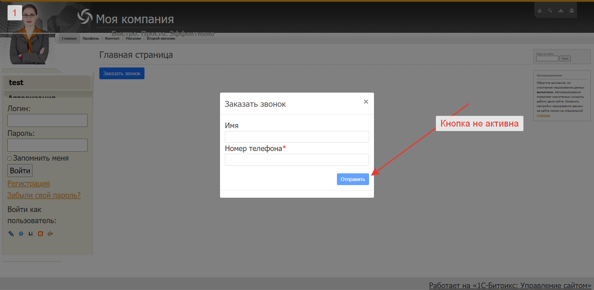
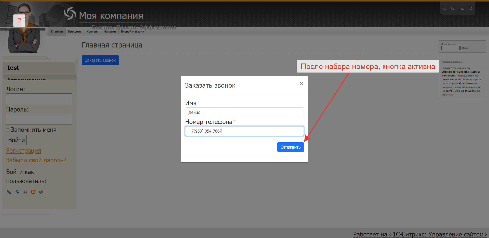
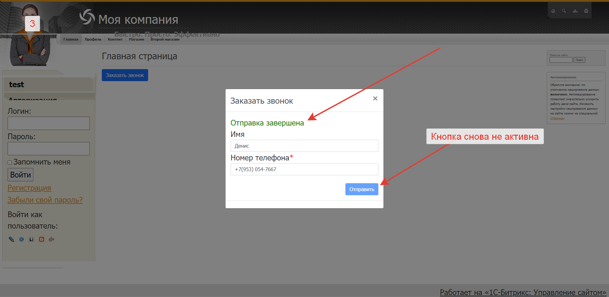
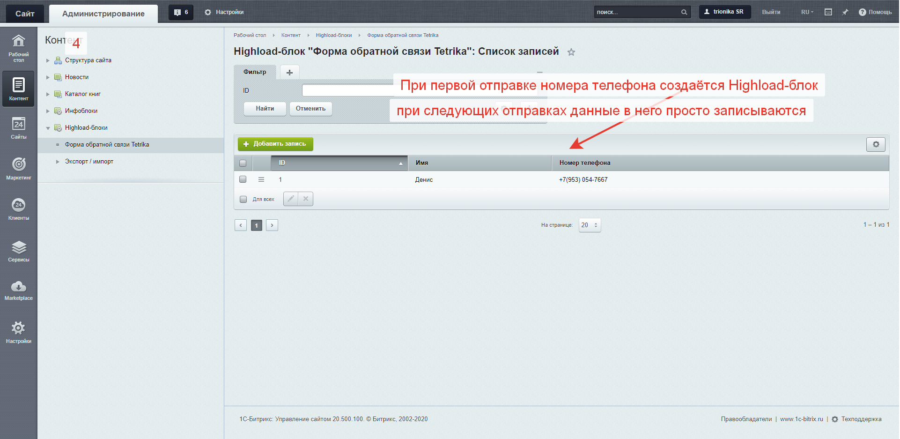
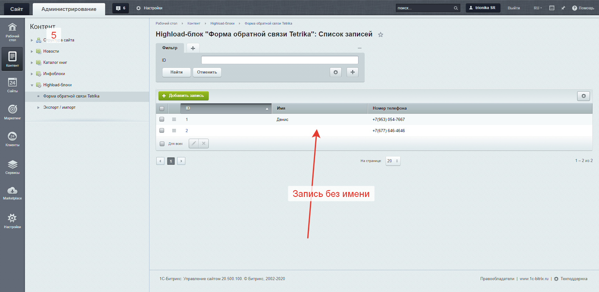
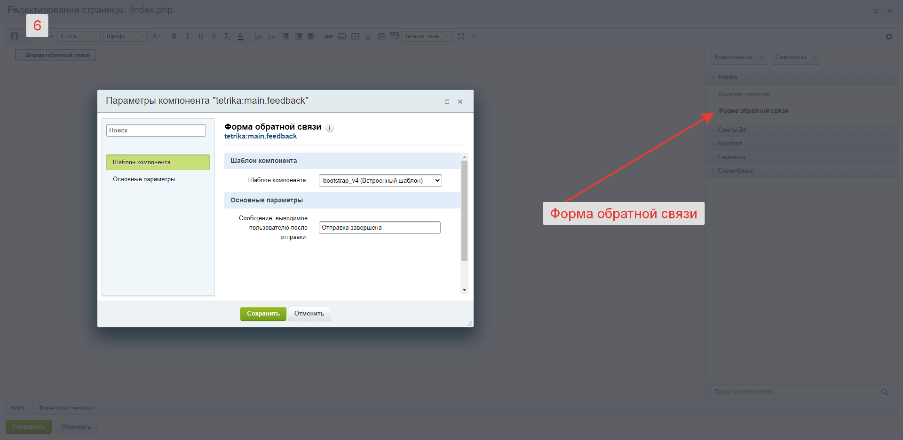

# Form-to-order-a-call-1C-Bitrix
Компонент для 1С-Битрикс, всплывающее окно с формой заказа звонка

При первой записи создаётся Highload-блок, в него записывается имя и номер телефона, 
при последующих записях данные просто записываются в уже созданный Highload-блок

Установка:    
Поместить папку tetrika в каталог local\components    
Обновить компоненты в публичной части сайта    

Скриншоты 

    
 
 
 
 
 